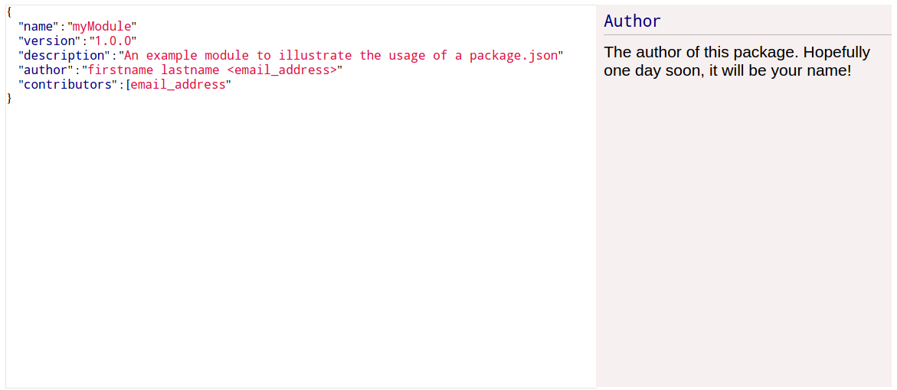

# InteractivePackage.json
A simple interactive Package.json guide, to teach you and me what is the exact meaning of every single attribute inside the 
**Package.json** file.

### Note :
All the definitions(for the moment) are from  [browsenpm](http://browsenpm.org/package.json), which is also the idea behind this tool.

## Important
This tool is still under developement, the code can change at any time. Enjoy the tool and don't forget to ask for feature requests and PRs.

## How to use it ?
Clone or download the zip file of this repository
and start the **index.html** page inside your favorite web browser, that's it.
